# GrammarPolice

[](https://github.com/tasszz2k/GrammarPolice/blob/main/LICENSE)
[](https://github.com/tasszz2k/GrammarPolice/stargazers)
[](https://www.apple.com/macos/)
[](https://swift.org/)

A powerful macOS menubar app for instant grammar correction and translation using AI. Works with any application through global hotkeys.

**Repository:** [https://github.com/tasszz2k/GrammarPolice](https://github.com/tasszz2k/GrammarPolice)

<!-- Add app icon here -->


## Features

- **Instant Grammar Correction** - Fix grammar in any app with a single hotkey
- **Multi-language Translation** - Translate from any language to your preferred target language
- **Global Hotkeys** - Works across all applications (Slack, VS Code, browsers, native apps)
- **Custom Words Protection** - Preserve brand names, technical terms, and custom words during correction
- **Multiple LLM Backends** - Support for OpenAI API and local LLMs (Ollama, LM Studio)
- **History Tracking** - View and export your correction/translation history
- **Privacy-focused** - Option to use local LLM for complete privacy

## Demo

<!-- Add demo GIF here -->
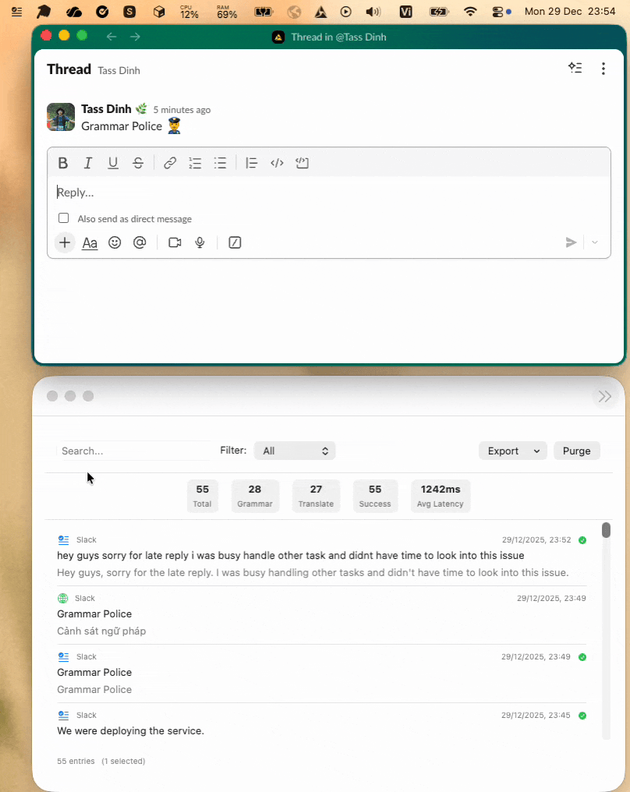

### Grammar Correction
Select text in any app and press `Ctrl+Cmd+G` to instantly correct grammar.

<!-- Add grammar correction screenshot -->
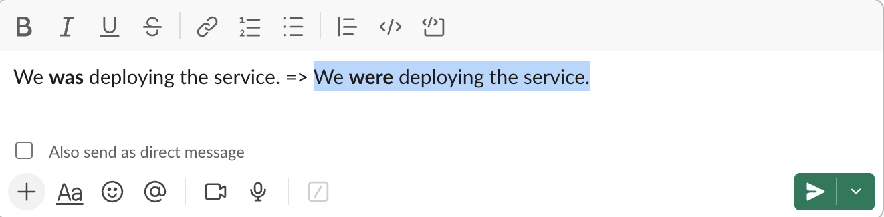

### Translation
Select text and press `Ctrl+Cmd+T` to translate to your preferred language.

<!-- Add translation demo GIF -->
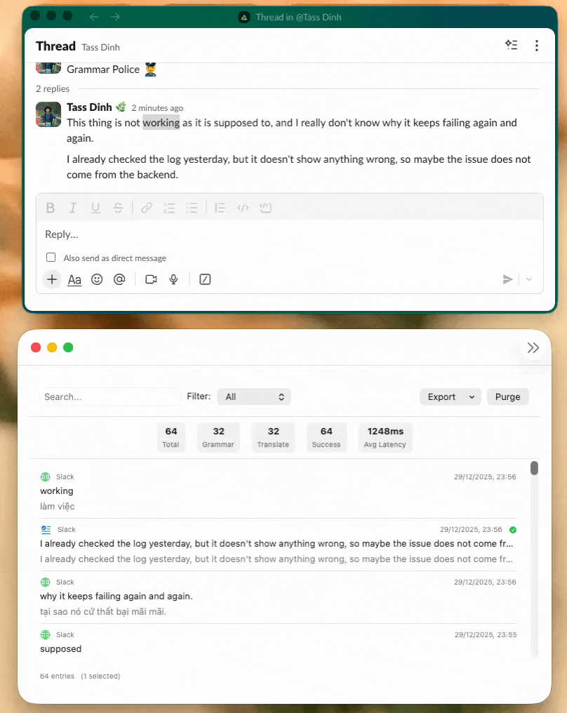

### Preferences
Configure hotkeys, LLM backend, grammar modes, and more.

<!-- Add preferences screenshot -->
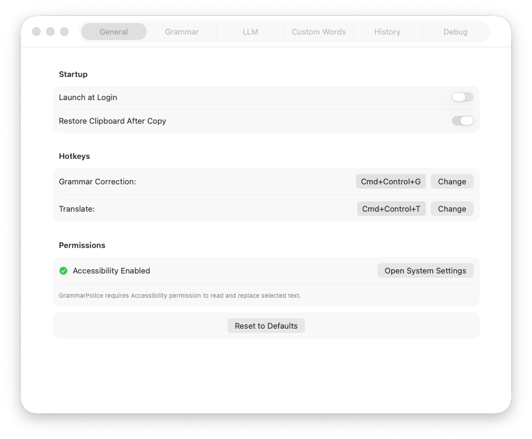

## Installation

### Requirements
- macOS 14.0 (Sonoma) or later
- Accessibility permission (required for text capture)
- OpenAI API key or local LLM setup

### Build from Source

1. Clone the repository:
```bash
git clone https://github.com/tasszz2k/GrammarPolice.git
cd GrammarPolice
```

2. Open in Xcode:
```bash
open GrammarPolice.xcodeproj
```

3. Build and run (`Cmd+R`)

### First Launch Setup

1. **Grant Accessibility Permission**
   - Go to System Settings > Privacy & Security > Accessibility
   - Enable GrammarPolice
   
   <!-- Add accessibility permission screenshot -->
   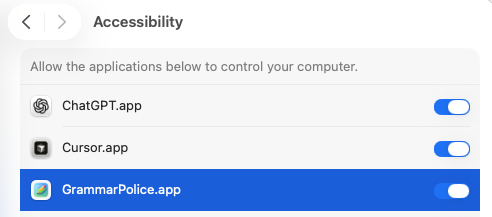

2. **Configure LLM Backend**
   - Open Preferences (click menubar icon > Preferences)
   - Go to LLM tab
   - Enter your OpenAI API key or configure local LLM

## Usage

### Hotkeys

| Hotkey | Action |
|--------|--------|
| `Ctrl+Cmd+G` | Correct grammar of selected text |
| `Ctrl+Cmd+T` | Translate selected text |

### Grammar Modes

| Mode | Description |
|------|-------------|
| **Minimal** | Fixes only grammar errors, preserves original tone |
| **Friendly** | Corrects grammar with a friendly, casual tone |
| **Work** | Professional, business-appropriate corrections |
| **Custom** | Use your own prompts for custom behavior |

### Translation

- Supports **any source language** - auto-detected
- Target languages: Vietnamese (default), English, Chinese, Japanese, Korean, Spanish, French, German, and more
- Translation appears in a dialog window (does not modify clipboard)

### Custom Words

Protect specific words from being modified during correction:

<!-- Add custom words screenshot -->
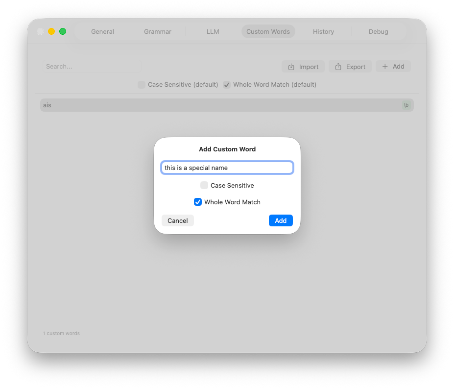

Examples:
- Brand names: `GrammarPolice`, `iPhone`, `OpenAI`
- Technical terms: `API`, `JSON`, `OAuth`
- Names: `John Doe`, `Acme Corp`

## Configuration

### LLM Backends

#### OpenAI (Recommended)
1. Get an API key from [OpenAI](https://platform.openai.com/)
2. Enter the key in Preferences > LLM
3. Select model (gpt-4o-mini recommended for speed/cost balance)

#### Local LLM
For complete privacy, use a local LLM:

**Ollama:**
```bash
# Install Ollama
brew install ollama

# Pull a model
ollama pull llama3

# Start Ollama server
ollama serve
```

Then configure in Preferences:
- Mode: HTTP Endpoint
- Endpoint: `http://localhost:11434/api/generate`
- Model: `llama3`

**LM Studio:**
1. Download and install [LM Studio](https://lmstudio.ai/)
2. Download a model
3. Start the local server
4. Configure endpoint in Preferences

## Screenshots

### Menubar Icon
<!-- Add menubar screenshot -->
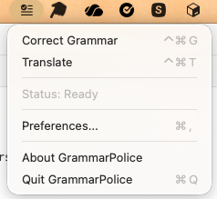

### Grammar Settings
<!-- Add grammar settings screenshot -->
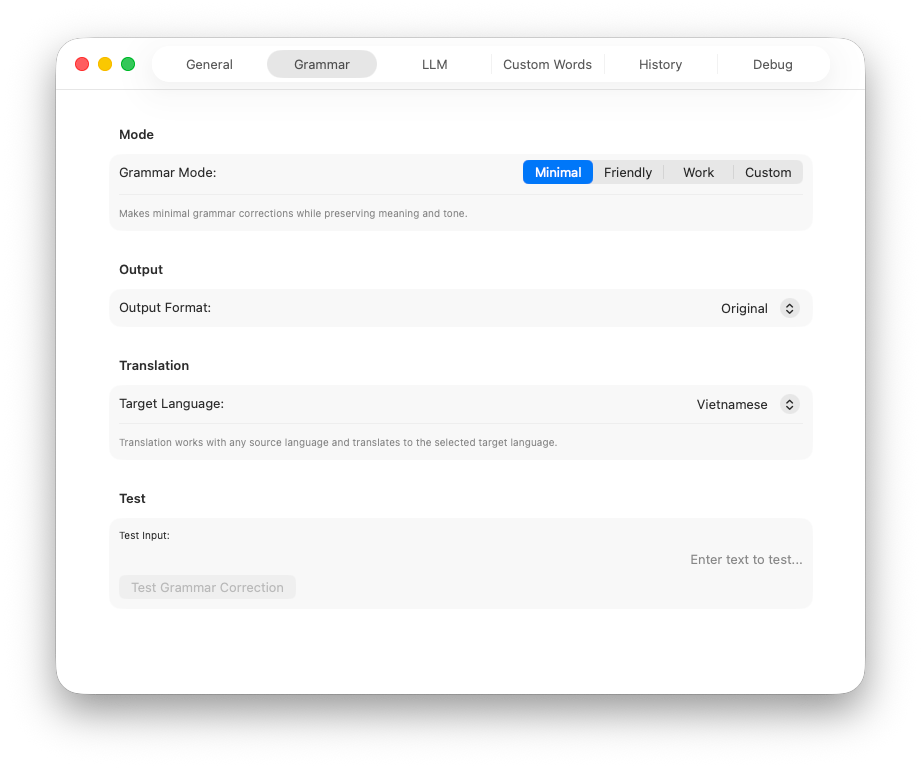

### LLM Settings
<!-- Add LLM settings screenshot -->
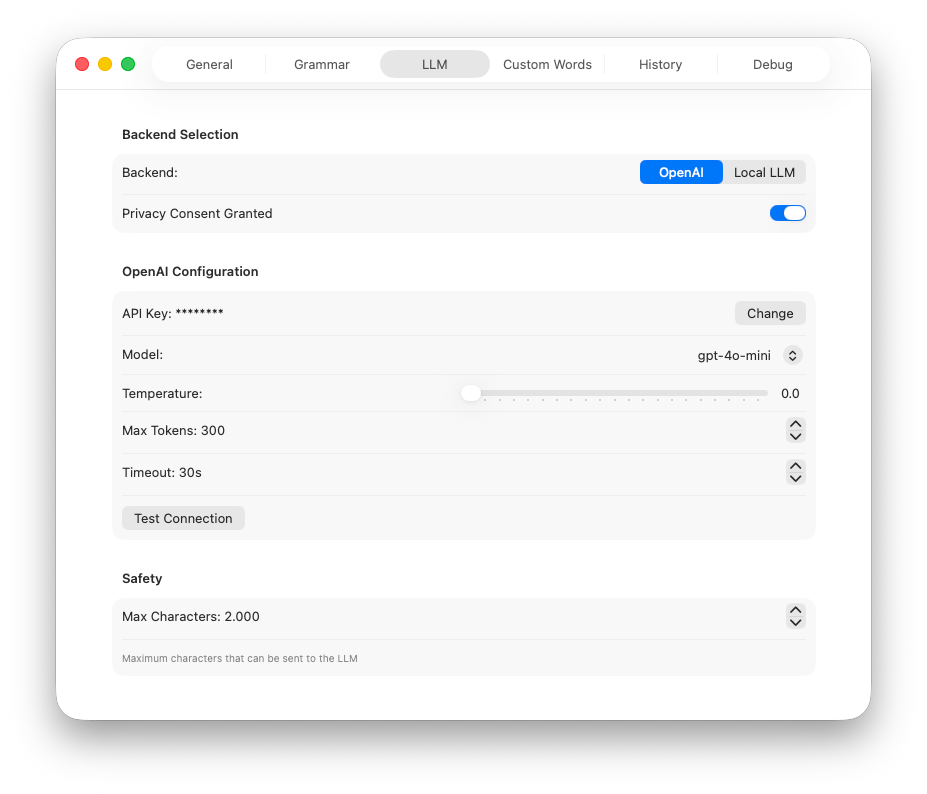

### History View
<!-- Add history screenshot -->
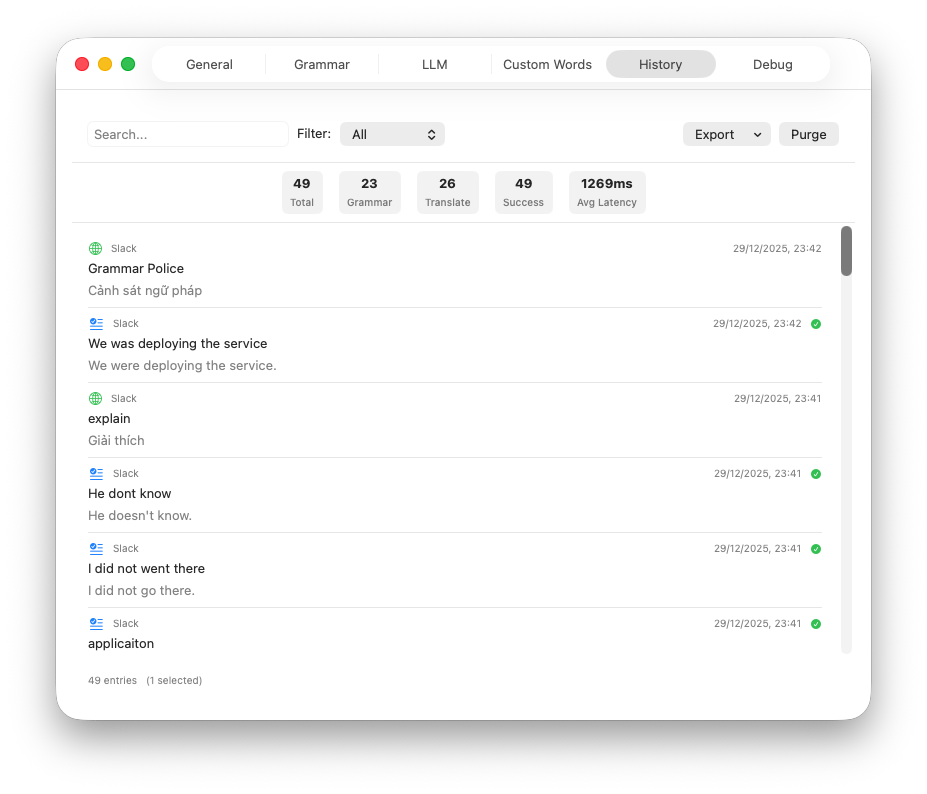

### Debug Logs
<!-- Add debug logs screenshot -->
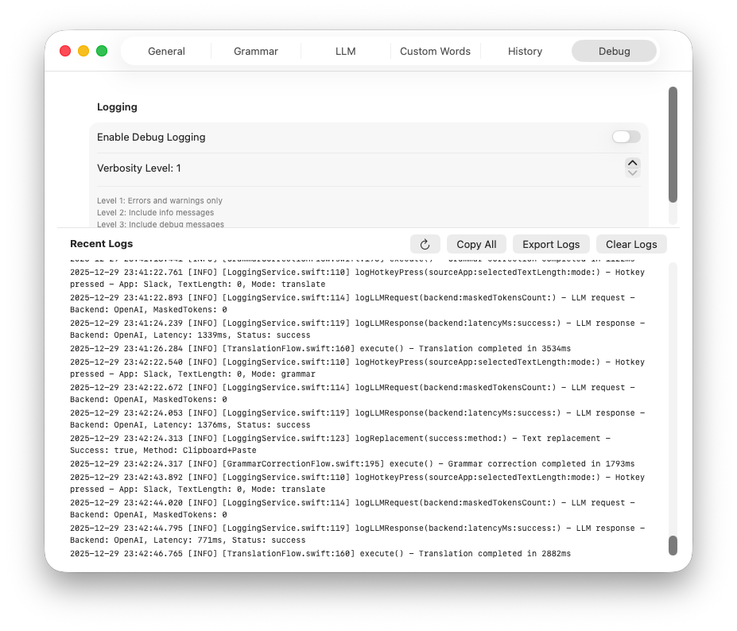

## Supported Applications

GrammarPolice works with virtually any application:

| App Type | Text Capture | Text Replacement |
|----------|--------------|------------------|
| Native macOS apps (Notes, TextEdit, Pages) | Accessibility API | Direct replacement |
| Electron apps (Slack, Discord, VS Code) | Clipboard fallback | Paste simulation |
| Browsers (Safari, Chrome, Firefox) | Clipboard fallback | Paste simulation |
| Terminal apps | Clipboard fallback | Paste simulation |

## Troubleshooting

### Hotkeys not working
1. Check Accessibility permission is granted
2. Restart the app after granting permission
3. Check for conflicting hotkeys in other apps

### No text captured
1. Ensure text is selected before pressing hotkey
2. Some apps may require clipboard fallback (automatic)
3. Check debug logs for details

### LLM errors
1. Verify API key is correct
2. Check internet connection
3. For local LLM, ensure server is running

## Privacy

- **OpenAI Mode**: Selected text is sent to OpenAI's servers
- **Local LLM Mode**: All processing happens locally on your machine
- No telemetry or analytics
- History stored locally in SwiftData

## Tech Stack

- **Swift 5** / **SwiftUI** / **AppKit**
- **SwiftData** for history persistence
- **Keychain** for secure API key storage
- **Accessibility APIs** for text capture
- **NSEvent** for global hotkey monitoring

## License

MIT License - see [LICENSE](https://github.com/tasszz2k/GrammarPolice/blob/main/LICENSE) for details.

## Contributing

Contributions are welcome! Please open an issue or submit a pull request.

## Acknowledgments

- OpenAI for the GPT API
- The macOS developer community

---

Made with care for better writing everywhere.
